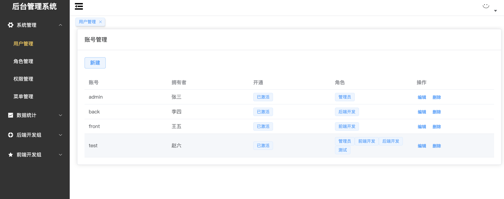
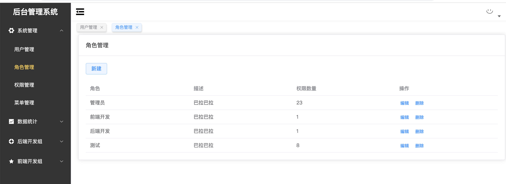
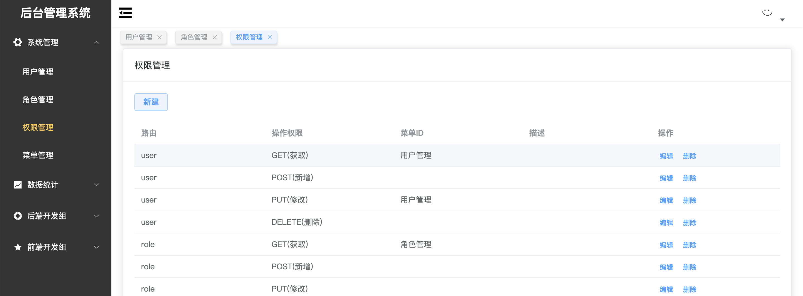
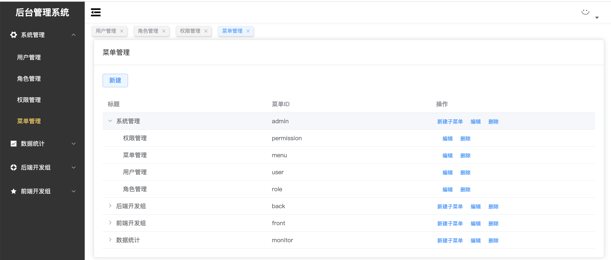
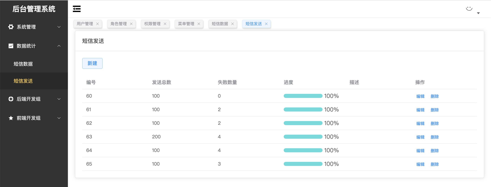
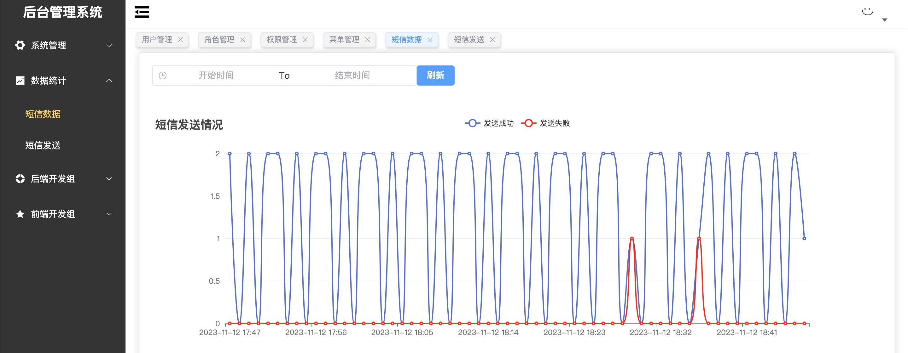

# admin_system
django drf +vue+elememt + celery 后台管理系统

代码是一个前后端分离的项目
主要的功能就是后端权限的精准控，每一个url权限都可以分为增删改查四个功能进行控制，并且与前端菜单进行联动。

### 1. 目录

​	backend：django后端

​	web：vue3前端

### 2. 功能

	1. 权限管理系统
	2. celery 分布式应用
### 3. 展示

